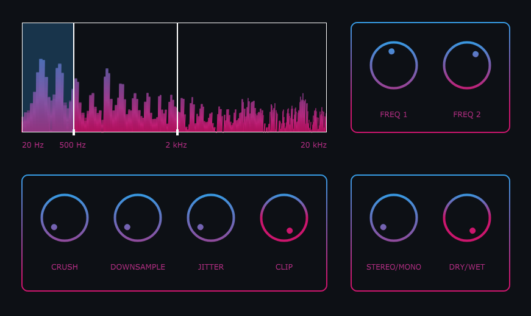

<h1>Sound of Music</h2>

<h3>Sound of music is a multi-band audio effect plugin that adds digital artifacts to an audio signal</h3>

 

    Sound of Music is a multiband bit crusher plugin with three bands, allowing detailed audio control and manipulation.

 
<h2><u>References</u></h2>
<ul type="none">
    <li>
        <a href="https://en.wikipedia.org/wiki/Bitcrusher">Crush</a>
    </li>
    <li>
        <a href="https://en.wikipedia.org/wiki/Bitcrusher">Downsample</a>
    </li>
    <li>
        <a href="https://headfonics.com/what-is-jitter-in-audio/">Jitter</a>
    </li>
    <li>
        <a href="https://humbuckersoup.com/soft-clipping-vs-hard-clipping-difference/">Clip</a>
    </li>
</ul>
