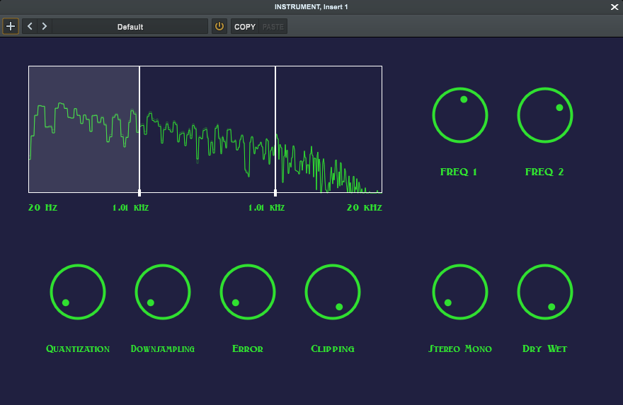

<h1>Sound of Music</h2>



<p>
    Sound of Music is a multiband bit crusher plugin with three bands, allowing detailed audio control and manipulation.
</p>

## Installation
### VST3 Installation (Windows)

1. **Download the Plugin:** Download Sound.of.music.vst3 from [releases](https://github.com/enter-opy/sound-of-music/releases).

2. **Install the Plugin:**
   - **Copy the file into your DAW's plugin directory.**
   - **Rescan Plugins:** Follow your DAW's instructions to rescan plugins or manually add the plugin if necessary.

### Build from Source
To build Sound of music from source:

1. **Clone the Repository:**
   ```bash
   git clone https://github.com/enter-opy/sound-of-music.git
   cd sound-of-music
2. **Install Dependencies:**
   - **Windows:** Make sure you have Visual Studio installed with the necessary components for C++ development.
   - **Mac:** Make sure you have Xcode installed with the command line tools.
3. **Build the Plugin:**

   **Windows:**
   - Open the project in Visual Studio.
   - Set the build configuration to `Release`.
   - Build the project by selecting `Build > Build Solution`.

   **Mac:**
   - Open the project in Xcode.
   - Set the scheme to `Release`.
   - Build the project by selecting `Product > Build`.
## Usage
- **Insert Plugin:** Load Sound of music plugin into your preferred digital audio workstation (DAW).
- **Adjust Frequency Bands:**
  - **freq1 Slider:** Set the boundary between low and mid bands.
  - **freq2 Slider:** Set the boundary between mid and high bands.
- **Select and Adjust Effects:**
  - Select and highlight the active band.
  - Adjust the following parameters for the selected band:
    - **Downsample:** Controls the sample rate,introducing aliasing.
    - **Quantization:** Controls the bit depth.
    - **Error:** Adds random fluctuation to the signal.
    - **Clip:** Controls the threshold level for clipping.
- **Stereo/Mono and Mix Controls:**
  - **Stereo Mono:** Controls the stereo width.
  - **Dry Wet:** Controls the balance between the dry signal and wet signal.

## Contributing
Contributions to Sound of music are welcome! If you'd like to contribute, follow these steps:
1. **Fork the Repository:** Start by forking the [Sound of music repository](https://github.com/enter-opy/sound-of-music).
2. **Make Changes:** Create a new branch, make your changes, and commit them to your branch.
3. **Create a Pull Request:** Push your changes to your fork and submit a pull request to the original repository.
## License
This project is licensed under the GNU General Public License. See the [LICENSE](https://github.com/enter-opy/sound-of-music/blob/main/LICENSE) for details.